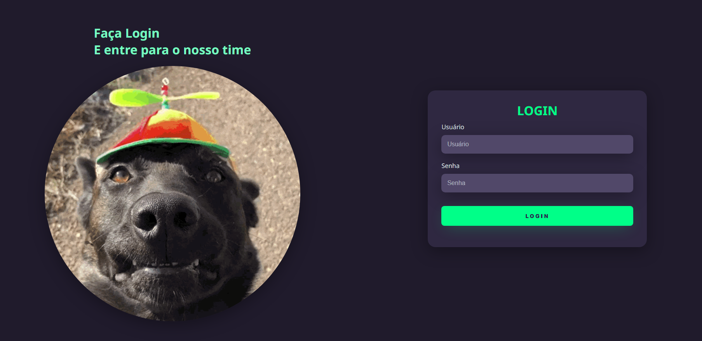
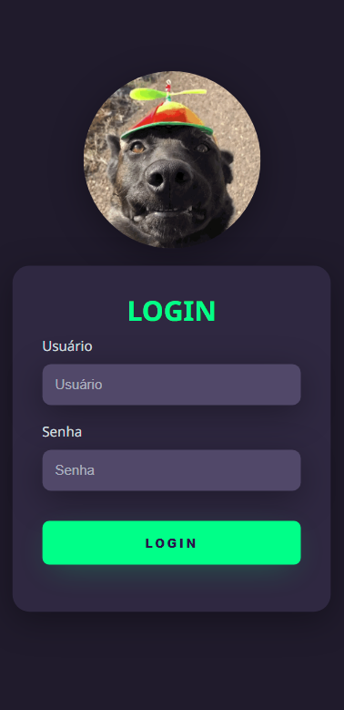

# Projeto Login 💻

# button-creator

## 🎯 Objetivo

Projeto desenvolvido através do Vídeo do canal [Markzuel](https://www.youtube.com/watch?v=69-WfrVBli8) com o objetivo de criar uma página de Login responsiva e funcional para Desktop e Mobile.

## 🛠️ Tecnologias utilizadas

Para o desenvolvimento deste site utilizei as seguintes tecnologias:

- HTML;
- CSS;
